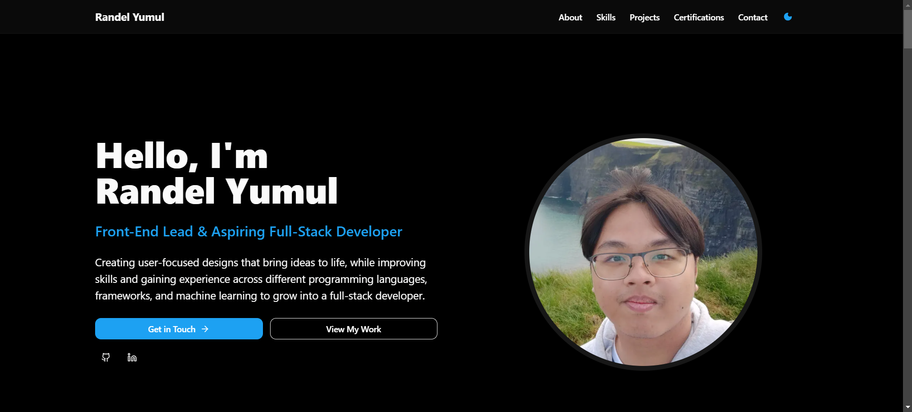

# 🚀 Randel Yumul – Software Developer Portfolio

[](https://nextjs.org/)
[](https://reactjs.org/)
[](https://tailwindcss.com/)
[](https://www.framer.com/motion/)
[](https://vercel.com/)

> A modern, responsive portfolio website built with **Atomic Design Methodology**. Showcases projects, skills, and experience with smooth animations and responsive design.



---

## 📋 Overview

Welcome! I'm **Randel Yumul**, a passionate software developer specializing in **web and mobile applications**.
This portfolio demonstrates my technical skills, projects, and design experience, built with reusable **atomic components**.

Sections included: **About Me, Skills, Projects, Contact**.

---

## 🛠️ Tech Stack (Used for Creation)

* **⚛️ Next.js** - React-based web framework
* **🎨 Tailwind CSS** - Utility-first styling
* **🎭 Framer Motion** - Animations and transitions
* **🧩 Atomic Design** - UI components organized as Atoms → Molecules → Organisms
* **🚀 Deployment** - Vercel

---

## ✨ Features

### 🎯 Core Sections

* **🏠 Hero / About Me** - Introduction and personal background
* **🛠 Skills** - Highlighting programming languages, frameworks, and soft skills
* **💼 Projects** - Showcase of web, mobile, and game projects
* **📫 Contact** - GitHub, LinkedIn, and email links

### 🎨 Design & UX

* **📱 Fully Responsive** - Optimized for desktop, tablet, and mobile
* **🌙 Dark/Light Mode Ready** - Theme switching support
* **🎭 Smooth Animations** - Powered by **Framer Motion**
* **♿ Accessibility** - Semantic HTML and ARIA compliance
* **⚡ Performance Optimized** - Fast loading and smooth interactions

---

## 🚀 Getting Started

### Prerequisites

* Node.js 18+ ([Download here](https://nodejs.org/))
* npm or yarn package manager

### Installation

```bash
git clone https://github.com/RandelYumul/portfolio.git
cd portfolio
npm install
npm run dev
# or
yarn install
yarn dev
```

Open [http://localhost:3000](http://localhost:3000) to view the portfolio.

### Build for Production

```bash
npm run build
npm start
# or
yarn build
yarn start
```

---

## 📁 Project Structure

```
portfolio/
├── public/
│   └── images/               # Project images in .webp format
├── src/
│   ├── app/
│   │   ├── favicon.ico        # Favicon for the website
│   │   ├── global.css         # Global styles
│   │   ├── layout.tsx         # Layout wrapper for pages
│   │   └── page.tsx           # Main landing page
│   ├── components/
│   │   ├── atoms/             # Small reusable components like buttons, badges, text
│   │   ├── molecules/         # Combinations of atoms forming functional blocks
│   │   ├── organisms/         # Larger sections composed of molecules
│   │   ├── ui/                # Card, modal, and other UI components
│   │   └─ theme-provider.tsx  # Handles dark/light theme toggling
│   └── lib/                    # Utilities, hooks, and shared logic
├── package.json               # Dependencies and scripts
├── tailwind.config.js         # Tailwind configuration
├── next.config.js             # Next.js configuration
└── tsconfig.json              # TypeScript configuration
```

---

## 🌐 Deployment

### Vercel

1. Connect GitHub repository to [Vercel](https://vercel.com/)
2. Automatic deployment on push to `main` branch
3. Fully optimized for **performance, SEO, and responsiveness**

**Live Portfolio:** https://portfolio-two-chi-28.vercel.app/

---

## 📞 Contact

* **GitHub:** [RandelYumul](https://github.com/RandelYumul)
* **LinkedIn:** https://www.linkedin.com/in/randel-yumul-7228502bb/(https://www.linkedin.com/in/randel-yumul-7228502bb/)
* **Email:** [[randel.angelo10@gmail.com][(mailto:randel.angelo10@gmail.com)]
* **Location:** Philippines

---

<div align="center">
  Built with ❤️ using **Next.js**, **Tailwind CSS**, and **Framer Motion**
</div>
